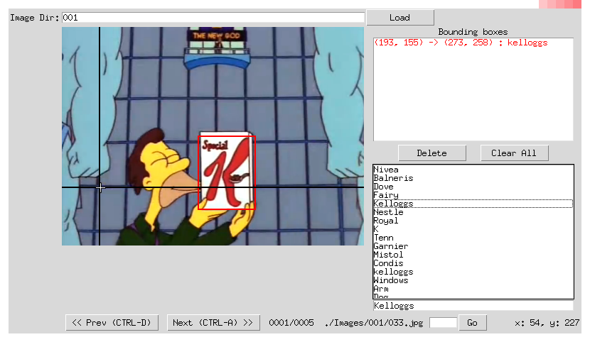

Yet Another Label Tool
===============

A simple tool for labeling object bounding boxes in images, implemented with Python Tkinter.
This fork implements an history of predefined classes for multi-label datasets and XML export function.

**Screenshot:**


Data Organization
-----------------
```
Yet another label tool
├── main.py   *# source code for the tool*
└── Images    *# direcotry containing the images to be labeled*
    ├── predefined_classes.txt
    └── 001
        └── .jpg files.
```
Environment
----------
- python 2.7
- python PIL (Pillow)

Run
-------
$ python main.py

Usage
-----
0. The images must be placed in a subfolder named 00X on Images/.
1. Input the folder name then click `Load`.
2. To create a new bounding box, left-click to select the first vertex. Moving the mouse to draw a rectangle, and left-click again to select the second vertex.
  - To cancel the bounding box while drawing, just press `<Esc>`.
  - To delete a existing bounding box, select it from the listbox, and click `Delete`.
  - To delete all existing bounding boxes in the image, simply click `ClearAll`.
3. An history of labels will be saved on predefined_classes.txt, new labels wrote in the bottom entry will be added and saved.
4. After finishing one image, click `Next` to advance. Likewise, click `Prev` to reverse. Or, input an image id and click `Go` to navigate to the speficied image.
  - Be sure to click `Next` after finishing a image, or the result won't be saved.
5. Save will export to .XML as well.
